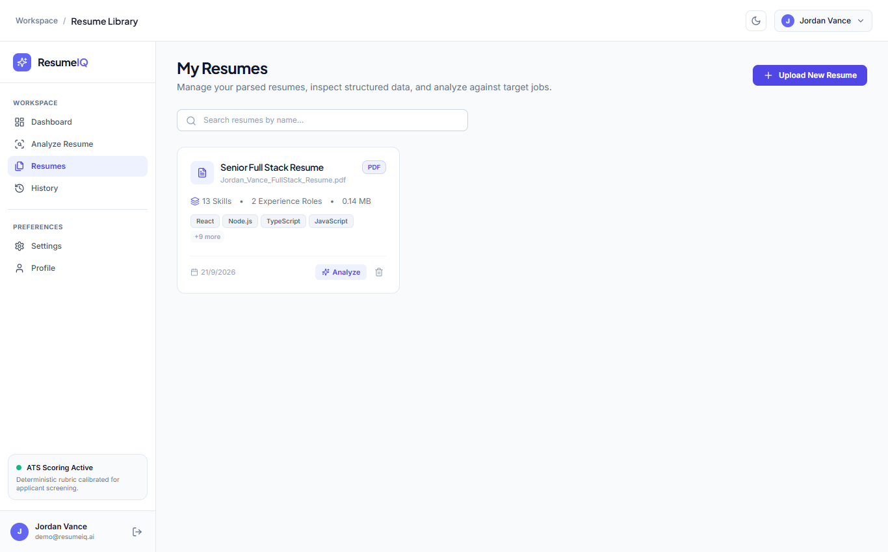

# ResumeIQ

An ATS resume analyzer and career optimization platform that uses deterministic scoring algorithms and grounded AI feedback to help candidates tailor their resumes for specific job descriptions.

---

## Screenshots

### 1. Workspace Dashboard
Track resume performance, recent evaluations, ATS match rates, and document health diagnostics.


### 2. Comprehensive ATS Analysis & Score Breakdown
Inspect deterministic score rings, 6-dimension breakdowns (Skills, Keywords, Experience, Projects, Quality, Education), strengths, and targeted gaps.


### 3. Resume Management Library
Manage parsed resumes, inspect structured skills and experience roles, and launch new job analyses.



---

## Why I Built This

Most existing resume checkers fall into one of two traps:

1. **Simple Keyword Counters**: They do a basic `string.includes()` search over the resume text. They miss real aliases (e.g., treating `ReactJS` and `React` as different things) and produce false positives (e.g., detecting the programming language `C` inside words like `React` or `Agile`).
2. **Pure Generative AI Tools**: They pass the whole resume and job description to an LLM and ask for an "ATS score out of 100". Because LLMs are probabilistic, running the same resume twice gives different scores, and the AI often hallucinates skills or metrics that the candidate never had.

**ResumeIQ solves this by keeping mathematical scoring completely separate from generative suggestions:**

- **The Scoring Engine is 100% Deterministic**: Every number is calculated using explicit mathematical rubrics, alias dictionaries, and regex word-boundary guards. Two identical runs always yield the exact same score.
- **The AI Layer is Qualitative Only**: Google Gemini is used solely for bullet rewrites, professional summary drafting, and evidence-grounded action items. It is strictly constrained by prompt rules requiring verbatim citations from the resume, and it falls back to local heuristic rules if no API key is provided or quotas are reached.

---

## Features

- **Resume Ingestion (PDF & DOCX)**: Upload and parse `.pdf` and `.docx` resumes in memory without writing uploaded files to disk.
- **Canonical Skill Taxonomy**: Internal dictionary of 200+ technical skills with alias normalization (`React.js` / `ReactJS` $\to$ `React`, `K8s` $\to$ `Kubernetes`, `Postgres` $\to$ `PostgreSQL`).
- **Collision-Safe Skill Matching**: Regular expressions with negative lookaheads and word boundaries prevent short skill tokens (`C`, `R`, `Go`, `Java`) from falsely matching inside standard English words or longer framework names.
- **Deterministic ATS Scoring (0–100)**: Transparent weighted score broken down across 6 categories:
  - Skills Match (30%) — weighted between required (75%) and preferred (25%) qualifications
  - Domain Keywords (20%) — coverage and frequency of domain terms
  - Experience Alignment (20%) — years of experience ratio combined with bullet quality
  - Project Relevance (15%) — alignment of technical projects with target tools
  - Resume Quality (10%) — action verb strength, quantified outcomes, and layout consistency
  - Education Fit (5%) — degree and field alignment (candidates are not penalized if a degree is optional)
- **Independent Resume Health Diagnostic**: Craftsmanship audit that scores document structure, metric density, and action verbs independently of any specific job description.
- **Evidence-Grounded Bullet Rewriter**: Rephrases weak bullet points using the Google X-Y-Z formula (`Accomplished [X], as measured by [Y], by doing [Z]`) without inventing imaginary numbers or experiences.
- **Role-Targeted Summary Optimizer**: Rewrites the professional summary to align with target role requirements using verified candidate skills.
- **Side-by-Side Resume Comparison**: Compare two versions of a resume against the same job posting to determine which version offers better technical coverage.
- **Multi-Resume & Target Job Management**: Save multiple resumes and target jobs in your workspace to run iterative evaluations.
- **Downloadable PDF Reports**: Export complete analysis reports via server-side `PDFKit` streaming, or use browser-native print stylesheets.
- **Dark & Light Mode**: Clean, accessible UI with system theme detection and manual toggle.

---

## How the Scoring Engine Works

The overall ATS Match Score is a weighted calculation across six distinct dimensions:

```
Overall Score = (Skills × 0.30) + (Keywords × 0.20) + (Experience × 0.20)
              + (Projects × 0.15) + (Quality × 0.10) + (Education × 0.05)
```

```
                        Resume Document (PDF/DOCX)
                                    │
                                    ▼
                         Text Extraction Engine
                       (unpdf, pdf-parse, mammoth)
                                    │
                                    ▼
                      Section Normalization & Regex
                    (Contact, Skills, Work, Projects)
                                    │
    Target Job Description          │
               │                    ▼
               └────────► Deterministic Scoring Engine
                          ├─ Skills Match (30%)
                          ├─ Keyword Coverage (20%)
                          ├─ Experience Match (20%)
                          ├─ Project Alignment (15%)
                          ├─ Craftsmanship Quality (10%)
                          └─ Education Fit (5%)
                                    │
                                    ▼
                      Independent Resume Health Score
                        (Verb strength, metric counts)
                                    │
                                    ▼
                      Grounded Qualitative Advice
                   (Gemini API with heuristic fallbacks)
                                    │
                                    ▼
                      Interactive Results Dashboard
```

### Why LLMs Do Not Calculate Scores
1. **Reproducibility**: If a candidate makes no changes to their resume, their score should not fluctuate.
2. **Explainability**: Candidates can inspect the exact formula, matched required skills, missing preferred skills, and keyword coverage.
3. **No Metric Hallucination**: AI models are prone to making up scores or rewarding arbitrary phrasing. Keeping scoring in pure code prevents this.

---

## Tech Stack

### Frontend
- **React 18**: Component-driven architecture using functional components and hooks.
- **Vite 6**: Fast development build tool and asset bundler.
- **Tailwind CSS 3**: Utility-first styling with full dark/light theme support.
- **Lucide React**: Clean SVG icon library.
- **Recharts**: Responsive score trend charts and radar diagrams.
- **React Router 6**: Client-side routing with protected route middleware.
- **Axios**: HTTP client configured with centralized response and error interceptors.

### Backend & Core Services
- **Node.js & Express 4**: RESTful API architecture.
- **MongoDB & Mongoose 8**: Document persistence for users, resumes, jobs, and evaluations.
- **mongodb-memory-server**: Automatically starts an in-memory database during local development if no external MongoDB URI is provided.
- **@google/generative-ai**: Google Gemini API SDK (`gemini-1.5-flash`) for qualitative analysis.
- **unpdf, pdf-parse & pdf2json**: Multi-layer PDF text stream extraction.
- **mammoth**: DOCX text and structure extraction.
- **PDFKit**: Programmatic server-side generation of downloadable PDF evaluation reports.
- **jsonwebtoken & bcryptjs**: Secure password hashing and token-based authentication via HTTP-only cookies.
- **Helmet & CORS**: HTTP security headers and configurable CORS protection.
- **express-rate-limit**: Route protection against brute-force and request bursts.

---

## Architecture

```
┌────────────────────────────────────────────────────────────┐
│                    Client (React 18 / Vite)                │
│  Pages • Components • Theme & Auth Contexts • Axios Client │
└─────────────────────────────┬──────────────────────────────┘
                              │ HTTP / REST (JSON + Cookies)
                              ▼
┌────────────────────────────────────────────────────────────┐
│                 Backend Server (Node.js / Express)         │
│  Middleware: Helmet • CORS • CookieParser • RateLimiter    │
├─────────────────────────────┬──────────────────────────────┤
│     Deterministic Services  │      External & Persistence  │
│  • Section Normalizer       │  • Google Gemini Generative  │
│  • Skill Taxonomy Engine    │    AI (with local fallback)  │
│  • 6-Category ATS Scorers   │  • PDFKit Report Generator   │
│  • Quality & Health Check   │  • MongoDB / Memory Server   │
└─────────────────────────────┴──────────────────────────────┘
```

The application is structured cleanly into two decoupled layers:
- `client/`: Single-page React application that interacts with `/api/*` endpoints.
- `server/`: Stateless REST API running on Express. When an analysis is requested, the scoring pipeline runs synchronously in code, while Gemini adds qualitative bullet suggestions.

---

## Project Structure

```text
ResumeIq/
├── client/
│   ├── src/
│   │   ├── components/
│   │   │   ├── analysis/       # BulletImproverModal, SummaryImproverModal
│   │   │   ├── auth/           # ProtectedRoute
│   │   │   ├── common/         # ScoreRing, ProgressBar, Badge, Navbar, Sidebar
│   │   │   └── resume/         # ResumeUploader, ResumeCompareModal
│   │   ├── context/
│   │   │   ├── AuthContext.jsx # User authentication & profile session
│   │   │   └── ThemeContext.jsx# Dark / light theme provider
│   │   ├── layouts/
│   │   │   └── AppLayout.jsx   # Main authenticated dashboard shell
│   │   ├── pages/
│   │   │   ├── Analysis.jsx    # Complete ATS score results & breakdowns
│   │   │   ├── Analyze.jsx     # Analysis runner (select resume & job)
│   │   │   ├── Dashboard.jsx   # Metrics, score history chart, quick actions
│   │   │   ├── History.jsx     # Past analysis records with search & filters
│   │   │   ├── Jobs.jsx        # Target job descriptions manager
│   │   │   ├── Landing.jsx     # Public landing page with live preview
│   │   │   ├── Login.jsx       # Unified Sign In & Create Account interface
│   │   │   ├── Profile.jsx     # Candidate target role & profile preferences
│   │   │   ├── Register.jsx    # User registration wrapper
│   │   │   ├── ResumeDetails.jsx # Parsed resume section inspector
│   │   │   ├── Resumes.jsx     # Resume library & document uploader
│   │   │   └── Settings.jsx    # Custom scoring weights & Gemini key setup
│   │   ├── services/
│   │   │   └── api.js          # Configured Axios instance with error handling
│   │   ├── App.jsx             # Route definitions
│   │   └── main.jsx            # React root mount point
│   ├── package.json
│   └── vite.config.js
│
├── server/
│   ├── src/
│   │   ├── config/
│   │   │   └── db.js           # MongoDB connection with in-memory fallback
│   │   ├── controllers/        # auth, user, resume, job, analysis, ai controllers
│   │   ├── middleware/         # auth (JWT), upload (Multer), rateLimit, errorHandler
│   │   ├── models/             # User, Resume, Job, Analysis Mongoose models
│   │   ├── prompts/            # Google X-Y-Z bullet rewrites & analysis prompts
│   │   ├── routes/             # REST endpoint routers (/api/*)
│   │   ├── services/
│   │   │   ├── ai/             # AIProvider (Gemini + rule-based heuristic fallbacks)
│   │   │   ├── job/            # Job description criteria extractor
│   │   │   ├── report/         # PDFKit report generator
│   │   │   ├── resume/         # Multi-engine PDF/DOCX parsers & normalizer
│   │   │   └── scoring/        # Deterministic scorers for skills, keywords, etc.
│   │   ├── utils/              # 200+ canonical skill dictionary & text cleaner
│   │   └── server.js           # Express application entry point
│   ├── tests/
│   │   ├── deepFix.test.js     # Skill collision & explanation benchmarks
│   │   ├── integration.test.js # Full end-to-end pipeline test
│   │   ├── normalizer.test.js  # Section segmentation unit tests
│   │   ├── run-tests.js        # Test runner
│   │   └── scoring.test.js     # Mathematical scoring unit tests
│   └── package.json
│
├── screenshots/                # Application preview images
├── docker-compose.yml          # Container configuration
├── .env.example                # Sample environment configuration
├── package.json                # Root helper scripts
└── README.md
```

---

## Getting Started

### Prerequisites

- **Node.js**: v18.0.0 or higher
- **npm**: v9.0.0 or higher
- *(Optional)* A running MongoDB instance. If no database URI is supplied, the application automatically launches an in-memory MongoDB server for local development.

### 1. Clone the Repository

```bash
git clone https://github.com/your-username/resumeiq.git
cd resumeiq
```

### 2. Configure Environment Variables

Copy the sample environment file to create your backend configuration:

```bash
cp .env.example server/.env
```

Open `server/.env` and configure your settings:

```env
NODE_ENV=development
PORT=5000

# Leave blank to use auto-started in-memory MongoDB in development
MONGODB_URI=

# Secret used to sign authentication JWTs (change to a random secure string)
JWT_SECRET=your_jwt_secret_key_here_at_least_32_characters

# URL of the client application for CORS
CLIENT_URL=http://localhost:5173

# Optional: Google Gemini API key for qualitative advice
# If left blank, the app will use local heuristic rule engines
GEMINI_API_KEY=
AI_MODEL=gemini-1.5-flash
```

### 3. Install Dependencies

Install dependencies for the root workspace, backend, and frontend:

```bash
# Install root packages
npm install

# Install server dependencies
cd server
npm install

# Install client dependencies
cd ../client
npm install
cd ..
```

### 4. Run Development Servers

You can start both servers using separate terminals or using the root scripts:

```bash
# Terminal 1 - Start the backend server (runs on http://localhost:5000)
cd server
npm run dev

# Terminal 2 - Start the frontend client (runs on http://localhost:5173)
cd client
npm run dev
```

Open `http://localhost:5173` in your browser. You can create a new account via the **Create Account** tab and immediately start uploading resumes and analyzing jobs.

---

## Environment Variables

| Variable | Required | Default | Description |
|---|:---:|:---:|---|
| `PORT` | No | `5000` | Port for the Express server to listen on |
| `NODE_ENV` | No | `development` | Environment mode (`development` or `production`) |
| `MONGODB_URI` | No | `""` *(auto in-memory)* | MongoDB connection string. When left empty, `mongodb-memory-server` boots automatically |
| `JWT_SECRET` | **Yes** | — | Cryptographic secret key used to sign session cookies |
| `CLIENT_URL` | No | `http://localhost:5173` | Allowed frontend origin for CORS requests |
| `GEMINI_API_KEY` | No | `""` | Google Gemini API key for qualitative recommendations. Uses local rule fallbacks if omitted |
| `AI_MODEL` | No | `gemini-1.5-flash` | Gemini model variant used for qualitative analysis |

---

## API Overview

All API endpoints are prefixed with `/api`. Protected routes require a valid session JWT passed via an `httpOnly` cookie or an `Authorization: Bearer <token>` header.

### Authentication
- `POST /api/auth/register` — Create a new candidate account.
- `POST /api/auth/login` — Authenticate credentials and issue session cookie.
- `POST /api/auth/logout` — Invalidate session and clear auth cookie.
- `GET /api/auth/me` — Return currently authenticated user profile.

### Resumes
- `POST /api/resumes` — Upload and parse a new resume document (PDF or DOCX).
- `GET /api/resumes` — List all resumes owned by the authenticated user.
- `GET /api/resumes/:id` — Retrieve structured extracted data for a resume.
- `GET /api/resumes/:id/debug` — View raw extracted text and section mapping.
- `PATCH /api/resumes/:id` — Update resume name or override parsed fields.
- `DELETE /api/resumes/:id` — Delete a resume document and its parsed records.

### Target Jobs
- `POST /api/jobs` — Parse and save a target job description.
- `GET /api/jobs` — List saved target job descriptions.
- `GET /api/jobs/:id` — Retrieve parsed criteria (required/preferred skills, keywords, experience).
- `PATCH /api/jobs/:id` — Update job description or extracted requirements.
- `DELETE /api/jobs/:id` — Delete a target job posting.

### Analyses & Reports
- `POST /api/analyses` — Run deterministic scoring and qualitative AI analysis on a resume-job pair.
- `GET /api/analyses` — List past evaluations with pagination and filters.
- `GET /api/analyses/:id` — Retrieve full analysis report, category breakdowns, and recommendations.
- `DELETE /api/analyses/:id` — Delete a saved analysis record.
- `POST /api/analyses/compare` — Compare two resume versions side-by-side against one job posting.
- `GET /api/analyses/:id/report` — Stream a downloadable server-generated PDF report.

### AI Enhancements
- `POST /api/ai/improve-bullet` — Rewrite an experience bullet using the Google X-Y-Z framework.
- `POST /api/ai/improve-summary` — Optimize a professional summary tailored to a target role.

### System Health
- `GET /api/health` — Returns system uptime and API status.

---

## Testing

ResumeIQ includes automated unit, benchmark, and end-to-end integration tests.

### Running Tests

Execute the full test suite from the `server` directory:

```bash
cd server
npm test
```

### What the Tests Verify:
1. **`normalizer.test.js`**: Checks that the canonical skill dictionary resolves aliases properly and verifies that section segmentation regex correctly extracts Contact, Experience, Skills, Education, and Projects.
2. **`scoring.test.js`**: Mathematically validates the deterministic scoring rubrics and weighting formulas across required vs. preferred criteria.
3. **`deepFix.test.js`**: Confirms that false-positive substring collisions (`C`, `Go`, `Java`) are prevented, verifies parser confidence calculations, and tests Google X-Y-Z bullet rewrites.
4. **`integration.test.js`**: Boots an in-memory MongoDB database, creates a test user, uploads a resume, creates a job, runs the full analysis pipeline, verifies document persistence, and cleans up.

---

## License

This project is licensed under the MIT License. See the [LICENSE](LICENSE) file for details.
