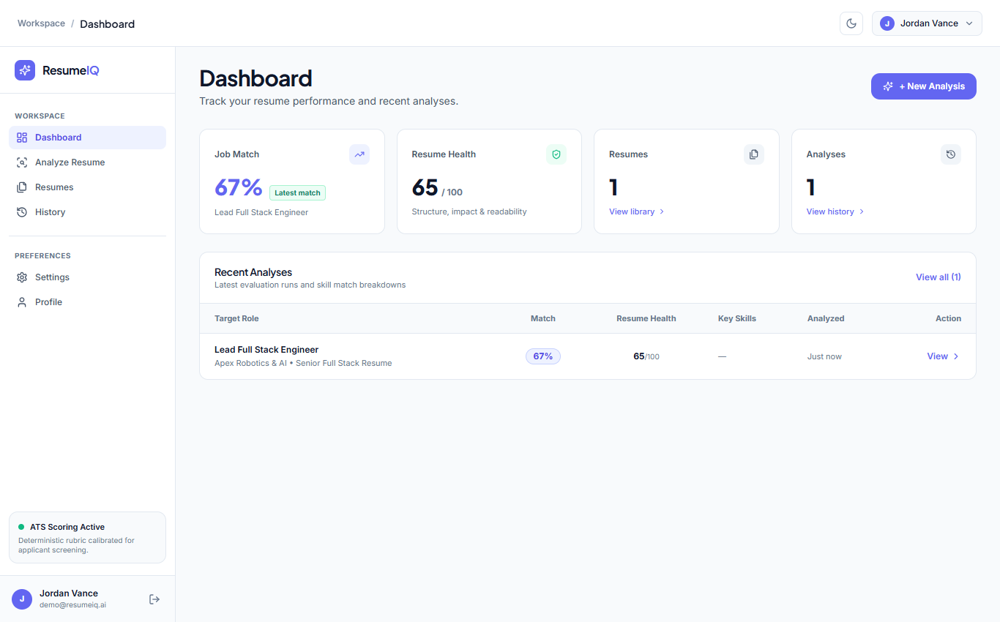
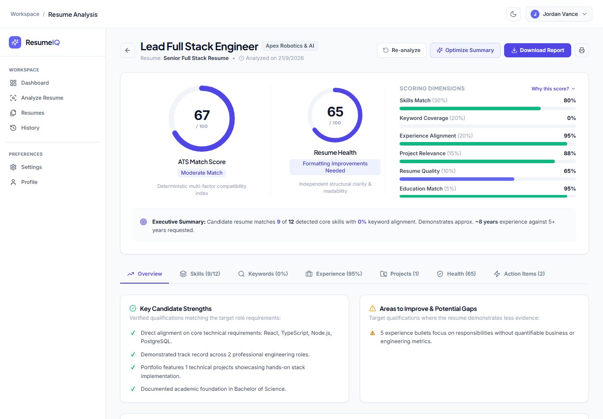

<h1 align="center">✨ ResumeIQ — AI Resume Analyzer & ATS Optimization</h1>

<p align="center">
  <i>“Understand how your resume matches the role — and exactly what to improve.”</i>
</p>

<p align="center">
  
  
  
  
  
  
  
  
  
  
</p>

<p align="center">
  ResumeIQ is a full-stack resume analysis platform that compares resumes against target job descriptions using structured parsing, deterministic ATS scoring, skill normalization, and evidence-grounded AI recommendations.
</p>


---

## Screenshots

### 1. Workspace Dashboard
Track resume performance, recent evaluations, ATS match rates, and document health diagnostics.



### 2. Comprehensive ATS Analysis & Score Breakdown
Inspect deterministic score rings, 6-dimension breakdowns (Skills, Keywords, Experience, Projects, Quality, Education), strengths, and targeted gaps.




---

## Overview

```text
Resume
+
Target Job Description
        ↓
Document extraction
        ↓
Structured resume parsing
        ↓
Job requirement extraction
        ↓
Skill and keyword matching
        ↓
Deterministic ATS scoring
        ↓
Evidence-grounded AI analysis
        ↓
Actionable recommendations
```

ResumeIQ evaluates candidate resumes against target job postings by separating quantitative evaluation from qualitative guidance:

1. **Deterministic Backend Scoring**: The numerical match score (0–100) is calculated entirely by rule-based algorithms in the backend. It uses explicit category weights, canonical skill aliases, and word-boundary regex guards. The score never fluctuates between identical runs.
2. **Qualitative AI Guidance**: Google Gemini is used exclusively for narrative feedback, professional summary optimization, and bullet rewrites using the Google X-Y-Z format (`Accomplished [X], as measured by [Y], by doing [Z]`). Recommendations must cite exact excerpts from the resume, and local heuristic fallbacks engage automatically if the API key is missing or quotas are exceeded.

---

## Features

### Resume Processing
- **PDF & DOCX Upload**: In-memory document stream extraction using `unpdf`, `pdf-parse`, `pdf2json`, and `mammoth` (5MB upload limit).
- **Text Normalization**: Strips non-printable characters, normalizes line breaks, and standardizes bullet markers.
- **Section Detection**: Heuristic header detection identifies Summary, Skills, Experience, Education, Projects, and Certifications.
- **Structured Parsing**: Groups experience entries (title, company, dates, bullet points), academic history (degree, field, school), and contact links (email, phone, LinkedIn, GitHub).

### Job Analysis
- **Requirement Parsing**: Extracts required skills, preferred qualifications, and minimum years of experience from job descriptions.
- **Keyword Extraction**: Identifies industry-specific technical terms, methodologies, and architectural tools.

### Matching Engine
- **Canonical Normalization**: Resolves aliases into canonical forms (`React.js` $\to$ `React`, `Postgres` $\to$ `PostgreSQL`).
- **Collision Prevention**: Regex word boundaries and lookarounds ensure short tokens (`C`, `Go`, `Java`) do not match inside English words or unrelated tools.
- **Weighted Match Logic**: Evaluates required vs. preferred criteria (required skills carry 75% of the skill score weight; preferred carry 25%).

### Scoring Engine
- **Deterministic 6-Pillar Score**: Transparent 0–100 score composed of Skills (30%), Keywords (20%), Experience (20%), Projects (15%), Quality (10%), and Education (5%).
- **Independent Resume Health Diagnostic**: Evaluates action-verb impact, quantified outcome density, and structural integrity independently of any job posting.

### AI Advisory Layer
- **Evidence-Grounded Recommendations**: Every recommendation quotes a verbatim excerpt from the resume.
- **Bullet Rewriter**: Reformulates weak bullet points into outcome-driven statements using the Google X-Y-Z framework.
- **Metric-Safe Placeholders**: Inserts bracketed placeholders (`[improved performance by X%]`) instead of fabricating imaginary metrics.
- **Summary Optimizer**: Tailors professional summaries to target roles using verified candidate achievements.

### Product Features
- **Session Authentication**: JWT-based session management using secure `httpOnly` cookies with Bearer token fallback.
- **Workspace Dashboard**: Recent analyses, average match score, health diagnostic, and resume library overview.
- **Side-by-Side Comparison**: Compare two resume versions against the same job description.
- **PDF Report Generation**: Downloadable server-rendered PDF analysis reports generated with `PDFKit`.
- **Theme Support**: Built-in Dark and Light themes with persistent preference storage.

---

## Architecture


The application is structured into two decoupled components:
- **Client (React 18 / Vite)**: Handles user interaction, responsive visualizations (`Recharts`), modal dialogs, and authenticated routing.
- **Server (Node.js / Express)**: Orchestrates in-memory document parsing, regex normalization, deterministic scoring rubrics, database operations (`Mongoose`), and Gemini API requests.

---

## Scoring Model

The overall ATS Match Score (0–100) is calculated using explicit mathematical weights:

| Category | Weight | What It Measures |
| :--- | :---: | :--- |
| **Skills Match** | **30%** | Evaluates candidate skills against job requirements. Required skills represent 75% of the skill score; preferred skills represent 25%. |
| **Keyword Match** | **20%** | Measures frequency and coverage ratio of domain-specific terminology, frameworks, and tools in the resume body. |
| **Experience Match** | **20%** | Compares years of experience against role requirements (up to 70 points) and evaluates bullet point action verbs (up to 30 points). |
| **Project Match** | **15%** | Evaluates the alignment of candidate projects with target technologies and modern engineering complexity. |
| **Resume Quality** | **10%** | Measures document craftsmanship, action-verb strength, quantified outcome density, and structural layout completeness. |
| **Education Match** | **5%** | Assesses degree level and field of study alignment. Candidates are not penalized if a degree is not required by the job. |

> The match score is an internal resume-to-job relevance measure. It is not a prediction of interview selection or hiring outcome.

---

## AI Responsibility & Guardrails

> ResumeIQ does not delegate the numeric score to the language model. The backend calculates the score from structured matching results. Gemini is used for qualitative analysis, explanations, bullet improvements, summary improvements, and recommendations.

### Guardrails Implemented:
1. **Verbatim Evidence**: Recommendations must quote exact text from the candidate's resume to prevent fabricated claims.
2. **Zero Metric Invention**: When suggesting improvements, Gemini is prompted to insert bracketed placeholders (e.g., `[reduced latency by X% / Y ms]`) for candidate metrics rather than inventing numbers.
3. **Local Heuristic Fallbacks**: If the `GEMINI_API_KEY` is omitted, or if an API quota is exhausted, built-in rule engines supply structured advice and bullet suggestions without breaking the application flow.

---

## Skill Normalization & Collision Prevention

### Canonical Skill Normalization
Different candidates and job postings write the same technology in different ways. The skill taxonomy normalizes these variations into canonical identifiers:

```text
ReactJS
React.js  ────►  React
React JS

Node
NodeJS    ────►  Node.js
Node.js

K8s       ────►  Kubernetes
Postgres  ────►  PostgreSQL
```

### Collision-Safe Boundary Matching
Simple substring searching causes frequent false positives. ResumeIQ uses word-boundary regular expressions and negative lookaheads:

```text
Java        ≠   JavaScript      (word boundary isolates 'Java')
C           ≠   C++ / C#        (lookahead isolates 'C' from 'C++' and 'C#')
Go          ≠   Good / Google   (isolated token matching prevents sub-word matches)
Agile       ≠   Fragile         (word boundaries prevent substring matches)
```

---

## Tech Stack

| Layer | Technologies |
| :--- | :--- |
| **Frontend** | React 18, Vite 6, React Router 6, Axios, Recharts, Lucide React |
| **Styling** | Tailwind CSS 3 |
| **Backend** | Node.js, Express 4, Mongoose 8, jsonwebtoken, bcryptjs, cookie-parser, Helmet, CORS, express-rate-limit |
| **Database** | MongoDB (with `mongodb-memory-server` automatic fallback for local development) |
| **Document Parsing** | `unpdf`, `pdf-parse`, `pdf2json`, `mammoth` |
| **Reporting** | `pdfkit` |
| **AI Integration** | `@google/generative-ai` (Google Gemini API: `gemini-1.5-flash`) with rule-based fallback |
| **Testing** | Node.js Test Runner / Custom assertion framework (`tests/run-tests.js`) |
| **Containerization** | Docker, Docker Compose |

---

## Project Structure

```text
ResumeIq/
├── client/
│   ├── src/
│   │   ├── components/
│   │   │   ├── analysis/       # BulletImproverModal, SummaryImproverModal
│   │   │   ├── auth/           # ProtectedRoute
│   │   │   ├── common/         # ScoreRing, ProgressBar, Badge, Navbar, Sidebar
│   │   │   └── resume/         # ResumeUploader, ResumeCompareModal
│   │   ├── context/
│   │   │   ├── AuthContext.jsx # Authentication session & token management
│   │   │   └── ThemeContext.jsx# Dark/light theme state
│   │   ├── layouts/
│   │   │   └── AppLayout.jsx   # Authenticated dashboard layout shell
│   │   ├── pages/
│   │   │   ├── Analysis.jsx    # Complete ATS evaluation report view
│   │   │   ├── Analyze.jsx     # Analysis runner (select resume & job)
│   │   │   ├── Dashboard.jsx   # Metrics, score chart, recent evaluations
│   │   │   ├── History.jsx     # Analysis history with search & filters
│   │   │   ├── Jobs.jsx        # Target job descriptions manager
│   │   │   ├── Landing.jsx     # Public landing page
│   │   │   ├── Login.jsx       # Tabbed Sign In & Create Account view
│   │   │   ├── Profile.jsx     # Candidate target role & profile settings
│   │   │   ├── Register.jsx    # Registration route wrapper
│   │   │   ├── ResumeDetails.jsx # Structured resume section inspector
│   │   │   ├── Resumes.jsx     # Resume library & document uploader
│   │   │   └── Settings.jsx    # Scoring weights & personal Gemini key configuration
│   │   ├── services/
│   │   │   └── api.js          # Axios client with interceptors
│   │   ├── App.jsx             # Client route definitions
│   │   └── main.jsx            # React root mount
│   ├── package.json
│   └── vite.config.js
│
├── server/
│   ├── src/
│   │   ├── config/
│   │   │   └── db.js           # MongoDB connection & in-memory fallback
│   │   ├── controllers/        # auth, user, resume, job, analysis, ai controllers
│   │   ├── middleware/         # auth (JWT), upload (Multer), rateLimit, errorHandler
│   │   ├── models/             # User, Resume, Job, Analysis schemas
│   │   ├── prompts/            # Google X-Y-Z bullet rewrites & analysis prompts
│   │   ├── routes/             # REST endpoint routers (/api/*)
│   │   ├── services/
│   │   │   ├── ai/             # AIProvider (Gemini + rule-based heuristic engine)
│   │   │   ├── job/            # Job criteria parser
│   │   │   ├── report/         # PDFKit report generator
│   │   │   ├── resume/         # PDF/DOCX extractors & resume normalizer
│   │   │   └── scoring/        # Deterministic scoring rubrics
│   │   ├── utils/              # 200+ canonical skill dictionary & text cleaner
│   │   └── server.js           # Express app bootstrap
│   ├── tests/
│   │   ├── deepFix.test.js     # Skill collision & explanation benchmarks
│   │   ├── integration.test.js # End-to-end user pipeline test
│   │   ├── normalizer.test.js  # Section segmentation unit tests
│   │   ├── run-tests.js        # Test runner
│   │   └── scoring.test.js     # Deterministic scoring unit tests
│   └── package.json
│
├── screenshots/                # Application preview images
├── docker-compose.yml          # Multi-container Docker configuration
├── .env.example                # Sample environment variables
├── package.json                # Root development scripts
├── LICENSE                     # MIT License
└── README.md
```

---

## Installation & Setup

### Prerequisites
- **Node.js**: `v18.0.0` or higher
- **npm**: `v9.0.0` or higher
- *(Optional)* A running MongoDB instance. If no URI is provided, the backend automatically starts an in-memory database (`mongodb-memory-server`).
- *(Optional)* A Google Gemini API key. If omitted, the platform uses local heuristic rule engines.

### 1. Clone the Repository

```bash
git clone https://github.com/VinayKrishna-7/ResumeIQ.git
cd ResumeIQ
```

### 2. Configure Environment Variables

Create the backend configuration file from the example:

```bash
cp .env.example server/.env
```

### 3. Install Dependencies

Install dependencies for root, server, and client:

```bash
# Root packages
npm install

# Server dependencies
cd server
npm install

# Client dependencies
cd ../client
npm install
cd ..
```

### 4. Run Development Servers

Start the backend and frontend in separate terminals:

```bash
# Terminal 1 - Start the Backend API (runs on http://localhost:5000)
cd server
npm run dev

# Terminal 2 - Start the Frontend Client (runs on http://localhost:5173)
cd client
npm run dev
```

Open `http://localhost:5173` in your browser. You can create an account using the **Create Account** tab and immediately start uploading resumes.

---


## Database Configuration

- **Development Fallback**: In development, if `MONGODB_URI` is left empty, `server/src/config/db.js` launches an ephemeral in-memory database (`mongodb-memory-server`). This allows running the project locally without installing or configuring MongoDB.
- **Production**: Set `MONGODB_URI` to a persistent MongoDB URI (e.g. MongoDB Atlas connection string or local MongoDB daemon `mongodb://localhost:27017/resumeiq`).

---

### Health Check
| Method | Endpoint | Description |
| :--- | :--- | :--- |
| `GET` | `/api/health` | Returns server health status, uptime, and database connectivity |

---

## Testing

The backend includes an automated test suite verifying normalization, scoring accuracy, collision prevention, and the end-to-end pipeline.

### Running Tests

Execute the complete test suite from the `server` directory:

```bash
cd server
npm test
```

### Test Coverage Summary:
- **`normalizer.test.js`**: Verifies alias normalization in the canonical skill dictionary and tests multi-section regex segmentation against varied resume layouts.
- **`scoring.test.js`**: Validates the mathematical scoring rubrics, required vs. preferred skill weighting, and edge cases (missing sections, zero experience).
- **`deepFix.test.js`**: Tests collision prevention (`C`, `Go`, `Java`), confidence score calculations, data-driven explanation generation, and Google X-Y-Z bullet rewrites.
- **`integration.test.js`**: Launches an in-memory MongoDB instance, creates a test user, uploads a resume, creates a job, runs the full analysis pipeline, verifies document persistence, and cleans up.

---

## Limitations

- **Scanned Image-Only PDFs**: Text extraction reads embedded text streams. Scanned PDFs containing only raster images without an embedded text layer cannot be parsed without OCR.
- **Section Heading Conventions**: The normalizer relies on standard English heading keywords (e.g., *Experience*, *Work History*, *Education*, *Technical Skills*). Non-standard headings may be grouped into unclassified text.
- **Skill Taxonomy Scope**: Skill detection relies on the maintained canonical dictionary (200+ technologies). Niche or newly released libraries may require dictionary additions.
- **AI Rate Limits**: Free-tier Gemini API keys may encounter 429 rate limits under heavy burst traffic; in such cases, the system engages built-in rule-based heuristic fallbacks.
- **Score Meaning**: The ATS Match Score measures textual and technical alignment against job requirements; it is not a guarantee of an interview or hiring outcome.

---

## Future Improvements

- **OCR Extraction Fallback**: Integrate client/server OCR (e.g. Tesseract) to support scanned, image-only PDF resumes.
- **Semantic Skill Embeddings**: Augment canonical keyword matching with vector embeddings to match related conceptual qualifications.
- **Multi-Language Taxonomies**: Expand the skill taxonomy and section detector to support resumes in languages other than English.
- **ATS Template Export**: Enable direct export of optimized resume content into standardized, ATS-friendly Word (`.docx`) or LaTeX templates.

---

## License

This project is licensed under the MIT License. See the [LICENSE](LICENSE) file for details.
