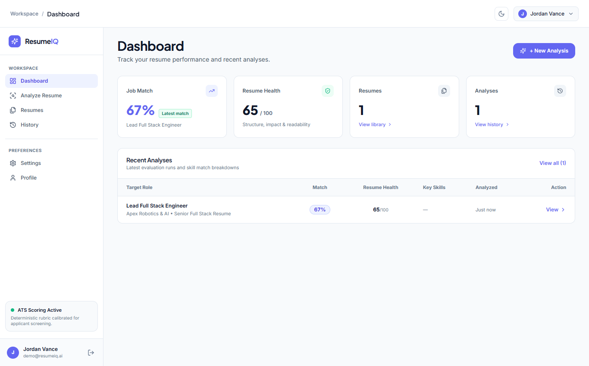
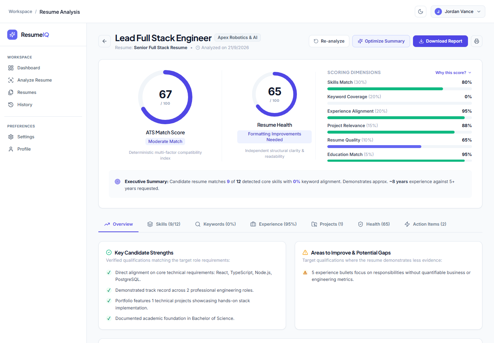

# ResumeIQ

A full-stack resume analysis and ATS optimization platform. ResumeIQ evaluates candidate resumes against target job descriptions, calculates transparent compatibility scores across multiple dimensions, and provides actionable recommendations to improve resume impact.


---

## Preview

| Dashboard & Upload | Analysis & Scoring Report |
| :---: | :---: |
|  |  |

---

## Overview

Most online ATS checkers rely either on simplistic keyword counting or opaque generative models that hallucinate metrics. ResumeIQ combines rule-based parsing and deterministic evaluation with contextual recommendations:

- **Multi-Format Extraction**: Parses PDF and DOCX files directly into structured sections (Summary, Experience, Education, Skills, Projects, and Contact Details).
- **Skill Taxonomy & Normalization**: Maps 200+ technical skill variations to canonical standards (e.g. `React.js` → `React`, `K8s` → `Kubernetes`) with boundary guards to eliminate false positives.
- **Calibrated Scoring Engine**: Scores resume compatibility on a reproducible 0–100 scale across 6 transparent dimensions.
- **Actionable Bullet Improvements**: Suggests quantifiable, Google-style *Action + Context + Impact* rewrites using verified metrics from candidate experience.
- **Resume Version Comparison**: Compare two resume versions side-by-side against the same target role to track measurable improvements.
- **PDF Report Generation**: Exports comprehensive audit reports with detailed score breakdowns and recommendations.

---

## Scoring Rubric

Match scores are calculated using a weighted multi-factor rubric:

| Dimension | Weight | Description |
| :--- | :---: | :--- |
| **Skills Match** | **30%** | Evaluates required skills (80% weight) and preferred skills (20% weight). |
| **Keywords Coverage** | **20%** | Measures technical domain vocabulary alignment and keyword density. |
| **Experience Alignment** | **20%** | Evaluates duration, role relevance, and action-verb quality in experience bullets. |
| **Project Relevance** | **15%** | Evaluates tech stack alignment, architectural depth, and project outcomes. |
| **Resume Quality** | **10%** | Evaluates document structure, readability, and presence of contact info. |
| **Education Match** | **5%** | Evaluates degree level and field of study relevance against role requirements. |

---

## Tech Stack

- **Frontend**: React 18, Vite 6, Tailwind CSS 3, Lucide Icons, Recharts
- **Backend**: Node.js, Express 4, Mongoose 8, JWT, Helmet, CORS
- **Document Parsing**: `pdf-parse`, `pdf2json`, `unpdf`, `mammoth`
- **PDF Generation**: PDFKit
- **Database**: MongoDB (supports both local/cloud MongoDB and zero-setup in-memory database for development)

---

## Getting Started

### Prerequisites
- **Node.js**: `v18.0.0` or higher
- **npm**: `v9.0.0` or higher

### 1. Clone the Repository
```bash
git clone https://github.com/VinayKrishna-7/ResumeIQ.git
cd ResumeIQ
```

### 2. Configure Environment Variables
Copy the sample environment file in the `server` directory:
```bash
cp .env.example server/.env
```

> **Note**: An in-memory database is automatically initialized in development if `MONGODB_URI` is left blank. Supplying a `GEMINI_API_KEY` is optional (built-in evaluators provide fallback recommendations).

### 3. Install Dependencies
```bash
# Install backend dependencies
cd server
npm install

# Install frontend dependencies
cd ../client
npm install
cd ..
```

### 4. Run the Development Servers
Start the backend and frontend in separate terminals:

```bash
# Terminal 1 — Backend API (http://localhost:5000)
cd server
npm run dev

# Terminal 2 — Frontend Client (http://localhost:5173)
cd client
npm run dev
```

Visit **[http://localhost:5173](http://localhost:5173)** in your browser.

---

## Testing

Run the automated test suite covering unit normalizers, collision guards, scoring rubrics, and integration workflows:

```bash
cd server
npm test
```

---

## Project Structure

```text
ResumeIQ/
├── client/                     # Frontend React application
│   ├── src/
│   │   ├── components/         # Reusable UI & analysis modals
│   │   ├── pages/              # Dashboard, Analyze, Analysis, Jobs, Resumes
│   │   ├── services/           # Axios API client
│   │   └── utils/              # Client helpers
│   └── vite.config.js
├── server/                     # Backend Node.js / Express API
│   ├── src/
│   │   ├── config/             # Database connection & memory fallback
│   │   ├── controllers/        # Route controllers (Analysis, Resume, Job, Auth)
│   │   ├── models/             # Mongoose schemas
│   │   ├── routes/             # REST endpoints
│   │   ├── services/           # Parsing, scoring, reporting, and advisory
│   │   └── utils/              # Skill dictionary & text normalizer
│   └── tests/                  # Automated test suites
├── screenshots/                # Application preview images
└── README.md
```

---

## Author

**Vinay Krishna**
- GitHub: [@VinayKrishna-7](https://github.com/VinayKrishna-7)

---

## License

This project is licensed under the [MIT License](LICENSE).
